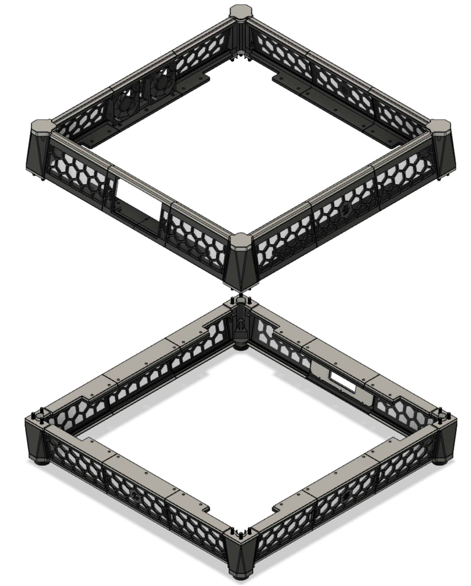
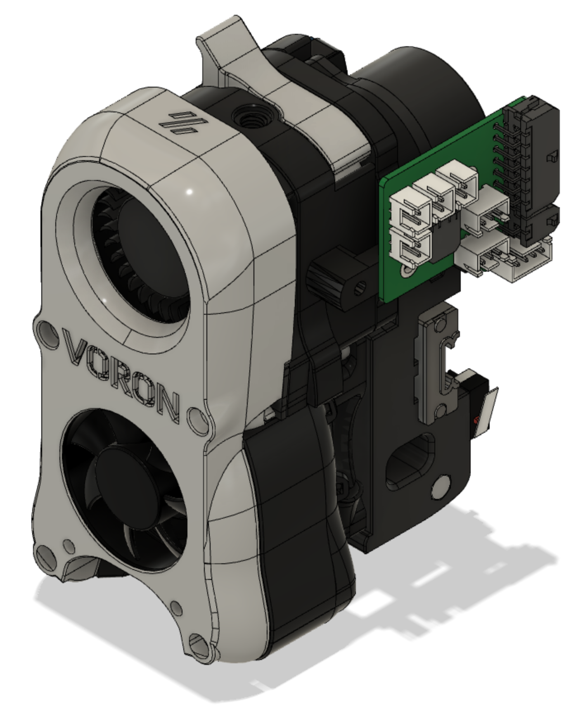
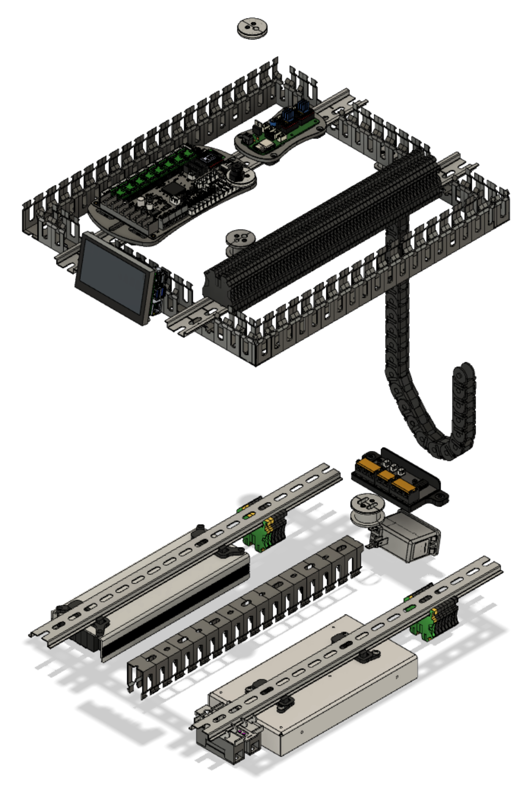
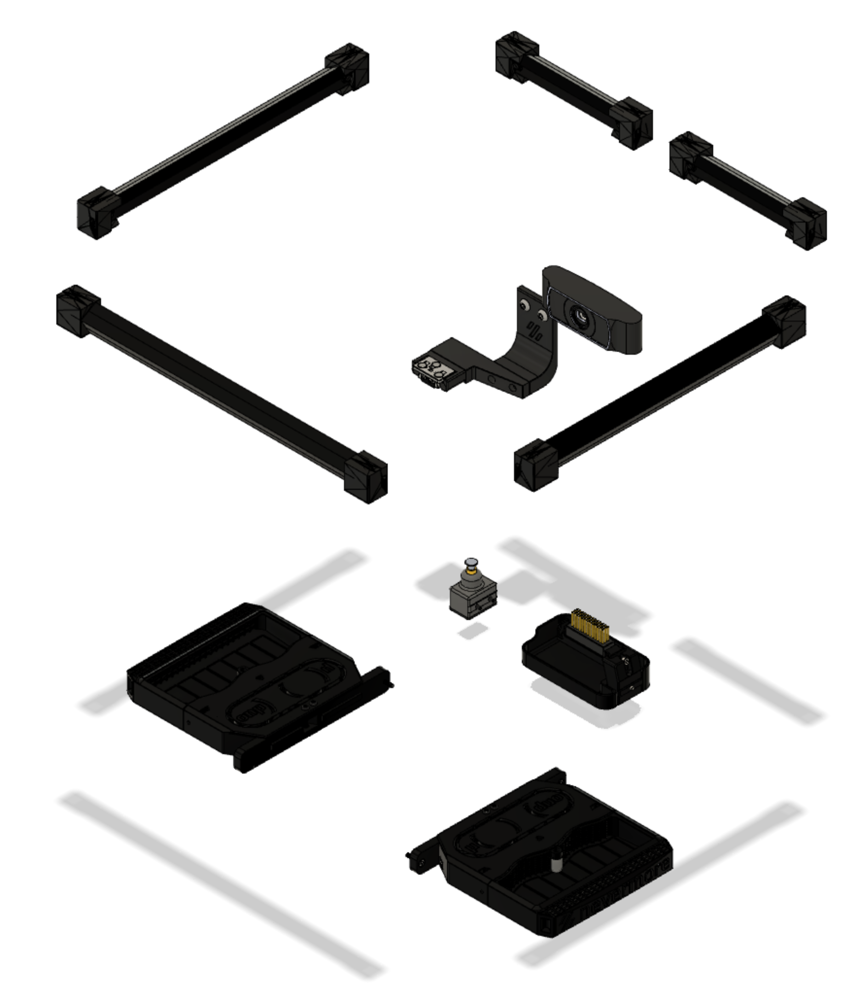
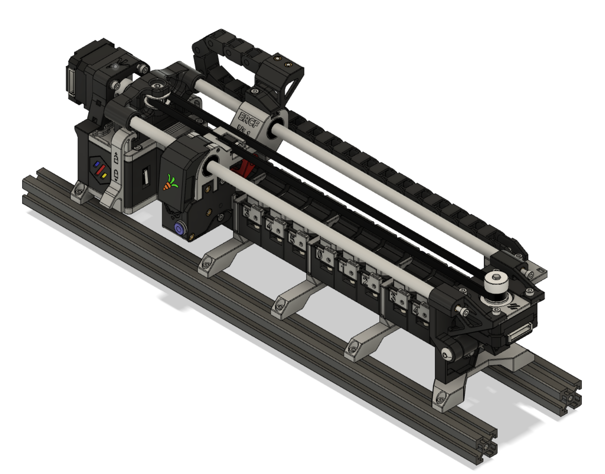

# DoomCube
Based on the DoomCube Mod for the Voron V2 and several popular Mods out there, I decided to capture my personalized DoomCube build in a full CAD.

This repository will list any Mods used that deviate from the regular Voron V2.4 and DoomCube build.

Different types of Mods are used in this build:
- Personal DoomCube modifications. These are the deviations from the original DoomCube files. **Please note: the modifications are specific to this particular build which is a 300m3 build. Be very carefull if you use these files and make sure they can be applied to your situation.** The files will be hosted under this "My DoomCube" Mod. You can find the files under [STL](STL)
- Official Mods. These are official Mods for the Voron V2.4 and DoomCube and are untouched by me and implemented as is. I will link to their official github where you will need to download the files relevant for you.
- Altered DoomCube specific Mods. These are Mods by me based on the official DoomCube files and applicable to any DoomCube build. They will be hosted seperately under the [Mods section of the official DoomCube repository](../..). You will need to download the files from their own mod repository.
- Voron V2 Mods by me. These are Mods by me that are applicable to any Voron V2 (Doomed or not) and will be hosted from my [own Github](https://github.com/mvieleers/Voron-V2) where you can download the files.

**If I don't specify a part, it means that you will need to download the STL from the [Original DoomCube repository](https://github.com/FrankenVoron/DoomCube-2), or in case the part is not listed there as well, from the original [Voron 2 repository](https://github.com/VoronDesign/Voron-2).**

[Make sure to join the DoomCube discord!](https://discord.gg/EAANfEk25f)

## CAD
A full CAD for this build will is available. For the most part it will include fasteners as well, with the exception for flanges, skirts and panelmounts.
As the CAD is 100 Mb+ it cannot be uploaded as one into Github. I've broken it up in different sections (one of these also needed to be zipped). When you import the STEP files into a new drawing, it will form one complete assembly again.

Click [HERE](CAD) for STEP files

## Frame

### Specifics
- 300m3 build.
- I'm using 20mm taller vertical 4040s, so the door, side and back panels all rest within an extrusion frame. This eliminates the need for the flanges to support the panels.
- Instead of 2020's for the top frame, I'm using 4020's.
- Instead of single 2020's for the bottom frame, I'm using double 2020's in the bottom frame in order for the panels to rest on top of the additional 2020 extrusion.
- The bed frame has a cross bar in order to mount my bed with 3 mounting points instead of 4. It is a preparation to add a kinematic bed mounting solution at a later time.

### Hardware
Section|Part| Part #|QTY|Remarks
|:---:|:----:|:----:|:---:|:---:|
Bottom Frame
||Bottom Horizontals|[HFSB5-2020-420-TPW](https://uk.misumi-ec.com/vona2/detail/110302683830/?HissuCode=HFSB5-2020-420-TPW&PNSearch=HFSB5-2020-420-TPW&KWSearch=HFSB5-2020-420-TPW&searchFlow=results2type)|8|Can be reused if you're converting from a standard V2 300
||OpenBuilds Angle Corner Connector|[20x20x20](https://openbuildspartstore.com/black-angle-corner-connector/)|4|Used to keep the two extrusions from rotating
||Slot Covers|[HSCKS5-B](https://uk.misumi-ec.com/vona2/detail/110302695120/?HissuCode=HSCL5-B&searchFlow=results2similartn)|1|Comes in 2m so needs to be cut to length
Vertical Frame
||Square Verticals|[HFSB5-4040-500-LWP-RWP-TPW](https://uk.misumi-ec.com/vona2/detail/110302684530/?HissuCode=HFSB5-4040-500-LWP-RWP-TPW&PNSearch=HFSB5-4040-500-LWP-RWP-TPW&KWSearch=HFSB5-4040-500-LWP-RWP-TPW&searchFlow=results2type)|4
||Slot Covers|[HSCKS5-B](https://uk.misumi-ec.com/vona2/detail/110302695120/?HissuCode=HSCL5-B&searchFlow=results2similartn)|2|Comes in 2m so needs to be cut to length
Top Frame
||Top Horizontals|[HFSB5-2040-420-TPW](https://uk.misumi-ec.com/vona2/detail/110302684350/?HissuCode=HFSB5-2040-420-TPW&PNSearch=HFSB5-2040-420-TPW&KWSearch=HFSB5-2040-420-TPW&searchFlow=results2type)|4
||Slot Covers|[HSCKS5-B](https://uk.misumi-ec.com/vona2/detail/110302695120/?HissuCode=HSCL5-B&searchFlow=results2similartn)|1|Comes in 2m so needs to be cut to length
Bed Frame
|||[HFSB5-2020-420-TPW](https://uk.misumi-ec.com/vona2/detail/110302683830/?HissuCode=HFSB5-2020-420-TPW&PNSearch=HFSB5-2020-420-TPW&KWSearch=HFSB5-2020-420-TPW&searchFlow=results2type)|2|Can be reused if you're converting from a standard V2 300
|||[HFSB5-2020-130](https://uk.misumi-ec.com/vona2/detail/110302683830/?HissuCode=HFSB5-2020-130&PNSearch=HFSB5-2020-130&KWSearch=HFSB5-2020-130&searchFlow=results2type)|1
||OpenBuilds Angle Corner Connector|[20x20x20](https://openbuildspartstore.com/black-angle-corner-connector/)|6|4 for securing the bed frame to the bottom frame, 2 to secure the cross bar. 4 can be reused if you're converting from a standard V2

## Panels

### Specifics
- The principle of the original DoomCube door is applied to the side and back panels, where the panels slide into panelmounts that bolt into the extrusion.
- Top and bottom panels use the original DoomCube mounting system. Unfortunately this requires them to be inserted during the build, but I haven't been able to come up with an alternative solution that allows for installation after the frame build.
- Top and bottom (deck) panels have cutouts for wire passthroughs and the top deck panel has mounting holes for mounting the ERCF on top of the top deck panel.

### Dimensions
Drawings are [here](Drawings), DXFs are [here](DXF)

Panel|Drawing|DXF|QTY
|:---:|:---:|:---:|:---:|
Door|panel_side.pdf|panel_side.dxf|2
Sides|panel_side.pdf|panel_side.dxf|4
Back|panel_back.pdf|panel_side.dxf|2
Top|panel_top.pdf|panel_top.dxf|2
Bottom|panel_bottom.pdf|panel_bottom.dxf|2
Top Deck|panel_top_deck.pdf|panel_top_deck.dxf|1
Bottom Deck|panel_bottom_deck.pdf|panel_bottom_deck.dxf|1

### Printed Parts
Section|Part|STL Origin|QTY
|:---:|:---:|:---:|:---:|
Door / Side / Back Panel Mounts
|Horizontal Panel Mounts|[This Mod](STL/Panels/Sides)|16
|Vertical Panel Mounts|[This Mod](STL/Panels/Sides)|16
Top / Bottom Panel
|Left and Right (Long) Center Panel Mount|[This Mod](STL/Panels/Top_Bottom)|4
|Front and Back (Short) Center Panel Mount|[This Mod](STL/Panels/Top_Bottom)|4
|Left and Right (Long) Side Panel Mount|[This Mod](STL/Panels/Top_Bottom)|8
|Front and Back (Short) Side Panel Mount|[This Mod](STL/Panels/Top_Bottom)|8

### Hardware
Hardware|Part|QTY|Remarks
|:---:|:---:|:---:|:---:
Vertical extrusions|[HFSB5-2020-458-LCH-RCH](https://uk.misumi-ec.com/vona2/detail/110302683830/?HissuCode=HFSB5-2020-458-LCH-RCH)|8
Horizontal extrusions|[HFSB5-2020-378-TPW](https://uk.misumi-ec.com/vona2/detail/110302683830/?HissuCode=HFSB5-2020-378-TPW)|8
Handle|[Aluminum Alloy Door Handle](https://nl.aliexpress.com/item/1407596513.html?spm=a2g0s.9042311.0.0.66fb4c4deTZEmA)|1|CAD shows printed door handle, I use this type of aluminum handle in size 120mm (ordered without screws and nuts)
Hinge|[HHPBSN5-SET](https://uk.misumi-ec.com/vona2/detail/110302362010/?HissuCode=HHPBSN5-SET&PNSearch=HHPBSN5-SET&KWSearch=HHPBSN5-SET&searchFlow=results2type)|2

## Skirts

### Specifics
- Basis is the hexagon skirts from the original DoomCube. 
- Due to side and back panel mounting system, flanges of the door are used all around as well as the panelmounts.
- Panelmounts are 2 pieces per side, instead of 3. This might not be printable on smaller bed sizes.
- Top and Bottom have altered top caps for the corners. These caps allow the deck panels to be attached to the corners with magnets.
- Top corners and skirts have been increased in size in order to accomodate my Waveshare 4,3" LCD. For this a center skirt was modded to hold the LCD.

### Dimensions
Drawings are [here](Drawings), DXFs are [here](DXF)

Panel|Drawing|DXF|QTY
|:---:|:---:|:---:|:---:|
Bottom Center Skirt Panel|skirt_bottom_center.pdf|skirt_bottom_center.dxf|3
Bottom Side Skirt Panel|skirt_bottom_side.pdf|skirt_bottom_side.dxf|8
Top Center Skirt Panel|skirt_top_center.pdf|skirt_top_center.dxf|3
Top Side Skirt Panel|skirt_top_side.pdf|skirt_top_side.dxf|8
Top LCD Skirt Panel|skirt_top_lcd.pdf|skirt_top_lcd.dxf|2

### Printed Parts
Section|Part|STL Origin|QTY
|:---:|:---:|:---:|:---:|
Square Corners Foot
||Bottom Corner|[Corner Panel Mounts](../corner_panel_mounts/STL)|4
||Top Corner|[This Mod](STL/Skirts/Corners/Top)|4
||Foot Mount (to extrusion)|[Original](../../../STLs/Corners/Square%20Extrusions)|8
||Bottom Corner Cap (panel mount)|[Corner Panel Mounts](../corner_panel_mounts/STL)|4
||Top Corner Cap (panel mount)|[This Mod](STL/Skirts/Corners/Top)|4
Skirts
||Bottom Center Skirt|[Original](https://github.com/FrankenVoron/DoomCube-2/tree/main/STLs/Skirts/Hexagon%20Skirts)|3
||Bottom Left Side Skirt|[Original](https://github.com/FrankenVoron/DoomCube-2/tree/main/STLs/Skirts/Hexagon%20Skirts/300)|4
||Bottom Right Side Skirt|[Original](https://github.com/FrankenVoron/DoomCube-2/tree/main/STLs/Skirts/Hexagon%20Skirts/300)|4
||Bottom Power Inlet Skirt|[Original](https://github.com/FrankenVoron/DoomCube-2/tree/main/STLs/Skirts)|1
||Bottom Power Inlet Skirt Inlay|[FN-286 Plug Panel](../fn-286_plug_panel)|1
||Top Center Skirt|[This Mod](STL/Skirts/Skirts/Top)|3
||Top Left Side Skirt|[This Mod](STL/Skirts/Skirts/Top)|4
||Top Right Side Skirt|[This Mod](STL/Skirts/Skirts/Top)|4
||Top LCD Skirt|[This Mod](STL/Skirts/Skirts/Top)|1 (NEEDS SUPPORTS)
Flanges
||Center Flange|[This Mod](STL/Skirts/Flanges)|8
||Side Flange|[This Mod](STL/Skirts/Flanges)|16
Skirt Accents
||Center Skirt Accent|[Original](https://github.com/FrankenVoron/DoomCube-2/tree/main/STLs/Skirts/Hexagon%20Skirts)|7
||Left Side Skirt Accent|[Original](https://github.com/FrankenVoron/DoomCube-2/tree/main/STLs/Skirts/Hexagon%20Skirts/300)|8
||Right Side Skirt Accent|[Original](https://github.com/FrankenVoron/DoomCube-2/tree/main/STLs/Skirts/Hexagon%20Skirts/300)|8

### Hardware
Hardware|Part|QTY|Remarks
|:---:|:---:|:---:|:---:
4.3" LCD|[Waveshare 4.3" LCD DSI](https://www.waveshare.com/4.3inch-dsi-lcd.htm)|1|The Raspberry Pi can be screwed to the LCD screen
Power Inlet|[Schaffner FN-286](https://www.digikey.nl/product-detail/en/schaffner-emc-inc/FN286-1-06/817-1928-ND/1997125?utm_adgroup=Power%20Entry%20Connectors%20-%20Inlets%2C%20Outlets%2C%20Modules&utm_source=google&utm_medium=cpc&utm_campaign=Shopping_Product_Connectors%2C%20Interconnects&utm_term=&productid=1997125&gclid=CjwKCAjw7fuJBhBdEiwA2lLMYTt-iqS_a8Cr28pWmyBAhIXpcLJp1rsu5ffDzC7lFXPegO6_Ck0uYBoCgaoQAvD_BwE)|1

## Heated Bed

### Specifics
- Mandela Rose Works ultra flat bed is used. It has mounting holes for both the V1.8 and the V2.4. Therefor I'm able to use a triangle 3-point mounting method, by inserting a cross bar between the two bed extrusions. This is also done to accomodate for a kinematic mounting system that is in development with Mandela Rose Works and uses 3 mounting points.
- When not using a kinematic mounting solution, you will only need 3 of the original knurled knuts

### Hardware
Hardware|Part|QTY|Remarks
|:---:|:---:|:---:|:---:
Mic6 Bed|[Mandala Rose Works Ultra Flat Bed](https://www.mandalaroseworks.com/shop/voron/voron-300-standard-bed)|1|
Heater|[Keenovo 240x240 600W 220V](https://keenovo.store/collections/standard-keenovo-silicone-heaters/products/keenovo-square-silicone-heater-3d-printer-build-plate-heatbed-heating-pad?variant=8324020961335)|1
Magnetic Sheet|[Graviflex 310x310](https://fermio.xyz/en/mechanical/magnetic-sheets/121/magnetic-sheet-310x310x1mm)|1|
Spring Steel Plate|[300x300 Spring Steel Plate](https://www.vonwange.com/product/300x300mm-1-4310-spring-steel-plate/)|1|
PEI Sheet|[Buildtak 12x12" PEI](https://www.buildtak.com/product/buildtak-3d-printing-surface-pei/)|1|
Knurled Nuts|Voron Standard Knurled Nuts|3|

## Z-Assembly

### Specifics
- Z-Drives are completely original DoomCube
- Motor Mounts are taken from the DoomCube CAD, there are no stl's for this in the repository which implies to use the original V2.4 parts. Those have 3 mounting points though, I like the 4 mounting points better, so I created the stl from the DoomCube CAD.
- The belt covers are modded from the original non-reflectix belt covers, I just added a somewhat different ledge to make a tighter integration to the panels.
- I'm using the 9mm pinned Z-Idlers

Section|Part|STL Origin|QTY
|:---:|:---:|:---:|:---:|
Z-Drive
||Z-Drive Main|[Original](https://github.com/FrankenVoron/DoomCube-2/tree/main/STLs/Z_Drives)|2 standard, 2 mirrored
||Z-Drive Retainer|[Original](https://github.com/FrankenVoron/DoomCube-2/tree/main/STLs/Z_Drives)|2 standard, 2 mirrored
Motor Mount
||Motor Mount|[This Mod](STL/Z-Assembly/Z-Drives)|2 standard, 2 mirrored
Z-Idler
||Belt Tensioner 9mm pinned|[Original](https://github.com/mvieleers/DoomCube-2/tree/main/STLs/Z_Idlers)|4
||Tensioner bracket|[Original](https://github.com/mvieleers/DoomCube-2/tree/main/STLs/Z_Idlers)|2 standard, 2 mirrored
Belt Cover
|| Belt Cover|[This Mod](STL/Z-Assembly/Belt%20Covers)|2 standard, 2 mirrored

## Gantry

### Specifics
The Gantry is a combination of several official Mods. Take good care to select the correct versions from each Mod so they work together.
|Mod|Creator|
|:---:|:---:|
|[MGN12 X axis](https://github.com/VoronDesign/VoronUsers/tree/master/printer_mods/arkeet/mgn12)|arkeet
|[Pins Mod](https://github.com/VoronDesign/VoronUsers/tree/master/printer_mods/hartk1213/Voron2.4_Pins_Mod)|hartk
|[Y Endstop Relocation](https://github.com/VoronDesign/VoronUsers/tree/master/printer_mods/hartk1213/Voron2.4_Y_Endstop_Relocation)|hartk
|[GE5C](https://github.com/hartk1213/MISC/tree/main/Voron%20Mods/Voron%202/2.4/Voron2.4_GE5C/STLs)|hartk
|[Gantry Backing Plates](https://github.com/VoronDesign/VoronUsers/tree/master/printer_mods/whoppingpochard/extrusion_backers)|whoppingpochard
|[lil a drive cable cover](https://github.com/mvieleers/DoomCube-2/tree/main/Mods/crag-h4k/lil-a-drive-cable-cover)|crag-h4k

### Hardware
There are no deviations from the standard Voron V2 in terms of extrusions.

## X-Carriage

### Specifics
Like the Gantry, the X-Carriage is a combination of several official Mods. Again, take good care to select the correct STL's that work with your setup.
|Mod|Creator|
|:---:|:---:|
|[BlueDragonX's Klicky Mods-Voron 2.4 Direct Mount MGN12 X Carriage](https://github.com/jlas1/Klicky-Probe/tree/main/Usermods/bluedragonx)|bluedragonx
|[Galileo Clockwork](https://github.com/JaredC01/Galileo)|JaredC01
|[AB-BN-30](https://github.com/VoronDesign/VoronUsers/tree/master/printer_mods/Badnoob/AB-BN)|Badnoob
|[Simple mount for Hartk board for galileo.](https://github.com/VoronDesign/VoronUsers/tree/master/printer_mods/Majarspeed/Hartk_Mount_Galileo)|Majarspeed
|[Afterburner Toolhead Board - ERCF version](https://github.com/hartk1213/MISC/tree/main/PCBs/Afterburner_Toolhead_PCB)|hartk
[Galileo ADXL345 Chain Replacement with Umbilical Mount](../adxl_mount_w_umbilical)|mvieleers
 
### Hardware
I'm using a Mosquito Standard Flow hotend.

## Electronics

### Specifics
- Wire grommet for passthrough of Tircowns ERCF easy board to the ERCF
- PTFE grommet for passthrough of PTFE from top deck panel to top panel
- PTFE and Umbilical grommet for passthrough of PTFE and Wires to the toolhead
- Wire grommet for the Z-chain wires
- Wire grommet for the wires trough the bottom panel to the bottom of the chamber
- All grommets are based on loco... wire grommet
- BED PCB for central connection of the wires at the bottom of the chamber. Bed Mains and Fuse, Bed Thermistor, Z Endstop, 2x bed fan or nevermore micro.
- DIN Mounts for BTT Octopus, Tircown's ERCF Easy Board, LRS-200-24

## Other

### Specifics
 - LED
 - Klicky Probe
 - hartk Sexbolt
 - Nevermore Duo, with modded plenum
 - Annex's purge bucket
 - Webcam mount for Wansview 1080o

## ERCF

### Hardware and Printed Parts
Please refer to the [Enraged Rabbit Github](https://github.com/EtteGit/EnragedRabbitProject)

### Specifics
 - 9 Channel ERCF. Number of channels irrelevant as I mount the ERCF to the extrusion and the extrusion is mounted to the top deck panel. 

#### A big thanks to all original authors for permission to include their mods in the Doomcube CAD!  Always follow the links to their respective repos for the latest stl's, and info on how to best make use of their mods.

